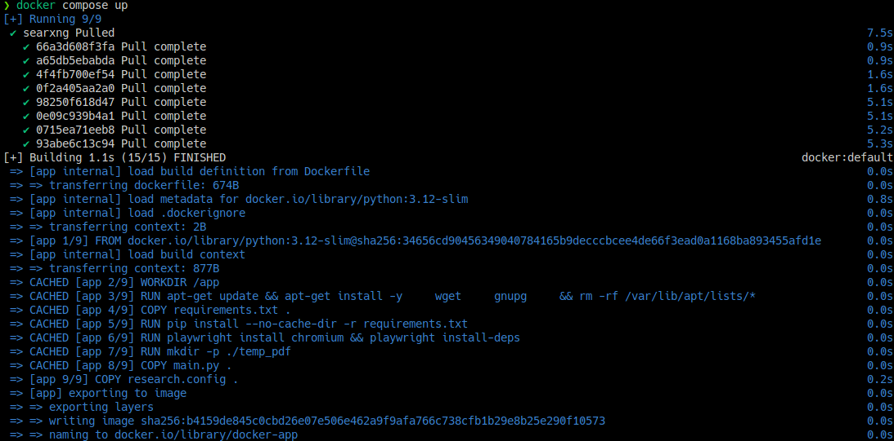
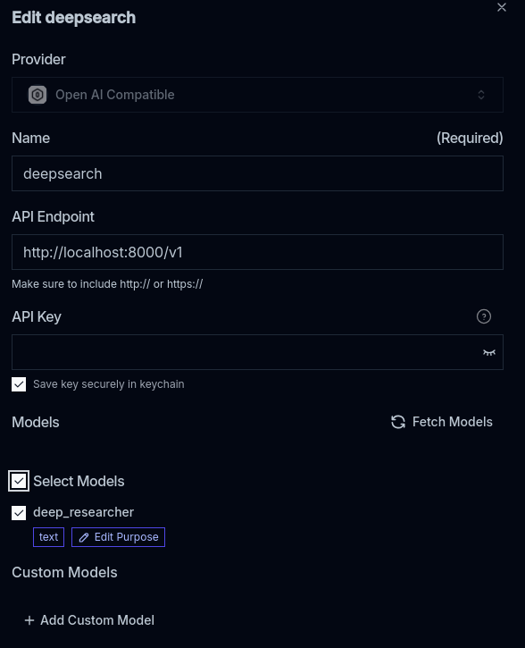
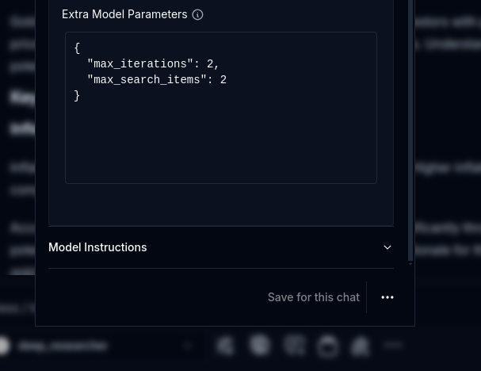
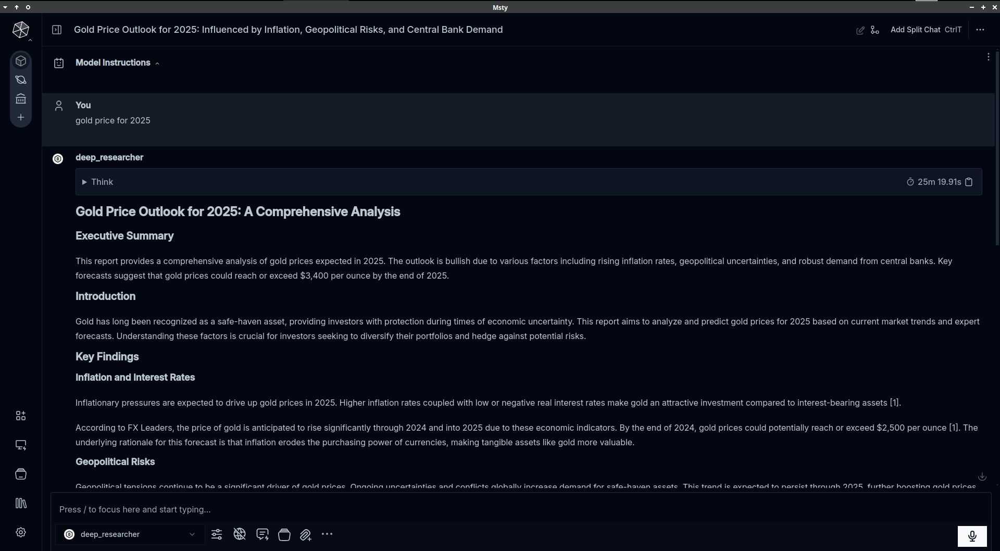

Hi, today I will teach you guys how to have a OpenAI deep research-like service(can also operate 100% local) in Msty with my new open source project.

# Pre-requisite

First, please make sure you have git installed
```bash
brew install git # Mac
winget install git # Win 10 or later
apt install git # Ubuntu
```

Then clone my repo to a place that you want to setup the service and store cache
```bash
git clone https://github.com/benhaotang/OpenDeepResearcher-via-searxng.git
cd OpenDeepResearcher-via-searxng/docker
```

# Setup

Now, open the research.config file in `OpenDeepResearcher-via-searxng/docker`, you will see there are many options, don't be overwhelmed by that. Simple modifications can already get you started.

Here are three operation modes you can choose from (minimal setup):

## 1. Online Mode (Maximum Speed and quality):
```ini
[Settings]
use_jina = true
use_ollama = false
default_model = anthropic/claude-3.5-haiku
reason_model = deepseek/deepseek-r1-distill-qwen-32b

[API]
openai_compat_api_key = your-openrouter-key
jina_api_key = your-jina-key
searxng_url = http://localhost:4000/search # Already setup for docker
searxng_url = https://searx.perennialte.ch/search  # If you don't want to setup docker or want to use a public instance
```

## 2. Hybrid Mode (Balance):
```ini
[LocalAI]
ollama_base_url = http://localhost:10000/ # See LocalAI service endpoint settings in Msty

[Settings]
use_jina = true
use_ollama = true
default_model = mistral-small    # Can use any model available in your Msty LocalAI
reason_model = deepseek-r1:14b   # Can use any model available in your Msty LocalAI

[API]
jina_api_key = your-jina-key
searxng_url = http://localhost:4000/search # Already setup for docker
searxng_url = https://searx.perennialte.ch/search  # If you don't want to setup docker or want to use a public instance
```
Note: You can use Msty's "LocalAI Models" GUI to download and manage models. Any model you have in Msty can be used by changing the model names in the config. If you want to use the default settings, **make sure to have mistral-small and deepseek-r1:14b are available in Msty and named as is**.

## 3. Fully Local Mode (Maximum Privacy):
```ini
[LocalAI]
ollama_base_url = http://localhost:10000/ # See LocalAI service endpoint settings in Msty

[Settings]
use_jina = false
use_ollama = true
default_model = mistral-small    # Can use any model available in your Msty LocalAI
reason_model = deepseek-r1:14b   # Can use any model available in your Msty LocalAI

[Concurrency]
use_embed_browser = true/false  # Choose between embedded or external browser

[API]
searxng_url = http://localhost:4000/search # Already setup for docker
searxng_url = https://searx.perennialte.ch/search  # If you don't want to setup docker or want to use a public instance
```
**Additional setup:**
- Use Msty's LocalAI GUI to download your preferred models and **reader-lm:0.5b** for webpage parsing
- For external browser (if use_embed_browser = false): Start Chrome with `google-chrome --remote-debugging-port=9222 --remote-debugging-address=0.0.0.0`, add `--user-data-dir=/path/to/profile` to bypass paywalled material with your own credentials.
- For embedded browser (if use_embed_browser = true): No additional setup needed


**Note about SearXNG:** You can either:
1. Use https://searx.perennialte.ch/ (a reliable public instance that supports JSON output)
2. Run SearXNG locally using the provided Docker setup
3. Use any other public SearXNG instance that supports JSON output (test with `https://your-searxng-url/search?q=test&format=json` - if it returns JSON data instead of 403, you can use it)

More advanced settings please consult the [README](./docker/README.md) in the docker folder.

# Start the service

Start the service using either Docker (recommended) or direct Python (in the `docker/` folder):
```bash
# Option 1: Using Docker (recommended), build time around 3 minutes for the first time
docker compose up --build

# Option 2: Direct Python
pip install -r requirements.txt
python main.py  # Runs on http://localhost:8000
```



When you see the following log:
```bash
INFO:     Started server process [1]
INFO:     Waiting for application startup.
INFO:     Application startup complete.
INFO:     Uvicorn running on http://0.0.0.0:8000 (Press CTRL+C to quit)
```
The service is ready to use.

# Msty Setup

After the server log shows it starts listening on port 8000, let's go back to set up Msty.

1. Open Msty, open "add remote model provider".
2. Choose "OpenAI compatible endpoint".
3. Set API endpoint to `http://localhost:8000/v1`.
4. Press "Fetch Models" button, the model name should automatically populate. 
5. Save and you can start using.
6. *[optional]* If you use local AI models, also make sure the models you want to use and **reader-lm:0.5b** is available in Msty.



You have some extra model parameters that you can set in the model options

```json
{
    "max_iterations": 5,
    "max_search_items": 4,
    "default_model": "mistral-small" 
    "reason_model": "deepseek-r1:14b"
}
```



These parameters control:
- max_iterations: Number of plan-search-evaluate cycles, higher means more thorough research but longer runtime. Default: 10
- max_search_items: Number of search results to process per query (only affects local mode). Default: 4
- default_model: Override the model used for search and writing from config. Optional, uses research.config setting if not set
- reason_model: Override the model used for planning and reasoning from config. Optional, uses research.config setting if not set

You are all set! Now you can start using the OpenAI deep research like service in Msty. Our endpoint also support printing inner process logs as thinking process. Enjoy!



*An exmaple running purely locally with default settings*

# Price prediction

- If you use the online mode, the cost is around \$0.1 to \$0.5 for simple reports in minutes or up to \$2 for complex reports in up to an hour. (Using Gemini 2.0 Flash paid version as reference, claude and o3-mini will be much expensive)
- If you use the hybrid mode, the cost is around \$0.01 to \$0.1 for even most comprehensive reports. But please ensure you have enough context length for the models to work with, recommend at least 32k tokens.
- If you use the fully local mode, the generation time will be a lot longer, for a 5 interation 4 search items report, it will take around 1 hour on my RX 7800 XT.

My example, a 8-pages proceeding style physics report going through 573 sources using online method took 51 min at €1.4 with Gemini 2.0 Flash(via openrouter) and Jina.

Of course, the above is if you don't count electricity bill.


# Limitations

Now there are some caveats that you should know:

- Currently system instruction are only writing style instructions, while search instructions are still working in progress.
- Multi-turn chat is not supported yet, so no follow-up questions possible.
- If you want to go full local, a GPU with **at least 12GB** is needed, as small models are bad at instruction following and agentic job and meanwhile you need to leave overhead for parsing.

# Roadmap

- [ ] Refine process and reduce token usage via DSPy.
- [ ] Support multi-turn chat and search instructions.
- [ ] Integrate tool calling.
- [ ] Add classifer models to fact-check sources by small models to avoid hallucination.

# Acknowledgement

Thanks to Matt for bootstrapping the project with Jupyter notebook. Thanks arq at Msty Discord channel for sharing early testing results. Thanks for the Msty team for providing such a great frontend for us to build on and all the open-source software we have used in this project, including [ollama](http://github.com/ollama/ollama), [searxng](https://github.com/searxng/searxng), [docling](https://github.com/DS4SD/docling), [playwright](https://github.com/microsoft/playwright), [Jina](https://huggingface.co/jinaai/reader-lm-1.5b) and many more.


