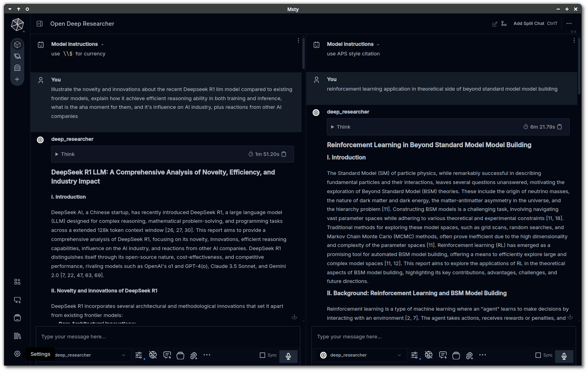
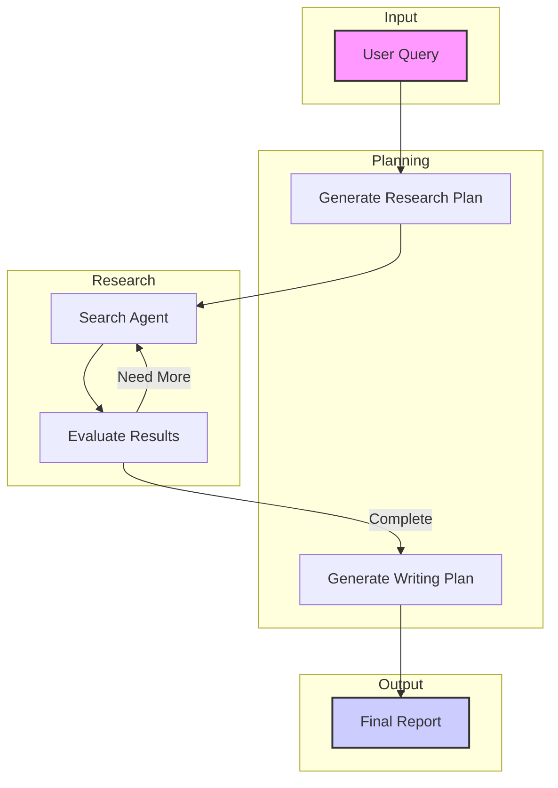

# OpenDeepResearcher via Searxng 🧑‍🔬

A robust research tool that uses AI to perform comprehensive research on any topic, offering flexible deployment through Docker, or simply direct Python execution as OpenAI compatible endpoint with whatever frontend you like, can also operate pure locally with [ollama](https://ollama.com) integration.



*A demo usage using hybird model with [Msty](https://msty.app) as frontend, there is also a dedicated [manual](./README-for-Msty.md) for Msty settings.*

## 🚀 Docker/Python Setup (Recommended)

The setup provides an OpenAI-compatible API endpoint with flexible configuration for different operation modes:

1. Configure `research.config` based on your needs:
   ```ini
   [Settings]
   # Choose your operation mode:
   use_jina = true/false    # Use Jina API for fast web parsing
   use_ollama = true/false  # Use local Ollama models
   with_planning = true     # Enable research planning
   
   # For online mode (Maximum Speed):
   use_jina = true
   use_ollama = false
   default_model = anthropic/claude-3.5-haiku
   reason_model = deepseek/deepseek-r1-distill-qwen-32b
   
   # For hybrid mode (Balance):
   use_jina = true
   use_ollama = true
   
   # For fully local mode (Maximum Privacy):
   use_jina = false
   use_ollama = true
   default_model = mistral-small
   reason_model = deepseek-r1:14b
   
   [Concurrency]
   use_embed_browser = true/false  # Use embedded browser instead of external Chrome
   
   [API]
   openai_url = https://openrouter.ai/api/v1/chat/completions # Most OpenAI compatible endpoint
   openai_compat_api_key = your-key-here  # For API authentication
   jina_api_key = your-jina-key          # Only needed if use_jina = true
   searxng_url = http://localhost:4000/search # Default for docker setup
   # OR use a reliable public instance if you don't want to setup docker:
   # searxng_url = https://searx.perennialte.ch/search
   ```

> [!TIP]
> If you want to use **free models** like gemini-experimental-xxx from google or on a lower usage tier, please set rate limits in `research.config`, read the troubleshooting section for more details.

2. Setup Requirements:
   - For local models (if use_ollama = true):
     ```bash
     ollama pull mistral-small    # search & writing
     ollama pull deepseek-r1:14b  # reasoning & planning
     ```
   - For local web parsing (if use_jina = false):
     ```bash
     # Option 1: Use external Chrome (use_embed_browser = false in research.config)
     # Start Chrome debug mode, add optional user-data-dir for profile with online credentials
     google-chrome --remote-debugging-port=9222 --remote-debugging-address=0.0.0.0 [--user-data-dir=/path/to/profile]
     
     # Option 2: Use embedded browser (use_embed_browser = true in research.config)
     # No manual Chrome setup needed, container manages headless browser automatically
     
     # Optional: Enhanced parsing
     ollama pull reader-lm:0.5b  # webpage parsing
     pip install docling         # PDF parsing
     ```

3. Choose your deployment:
   
   A. Using Docker and CPU (recommended):
   ```bash
   cd docker
   docker compose up --build
   ```

   A.1. Using Docker and GPU 
   ```bash
   docker compose -f docker-compose.xxx.yml up --build # xxx = cuda or rocm
   ```
   **But for most user, I still suggest using CPU version for smaller file size as GPU now is only used for accelerating PDF OCR in fully local mode**

   B. Direct Python (same functionality without containerization):
   ```bash
   cd docker
   pip install -r requirements.txt
   python main.py  # Runs on http://localhost:8000
   ```

4. Access points:
    - API: http://localhost:8000/v1 (OpenAI-compatible endpoint)
    - SearXNG: http://localhost:4000
    - Chrome Debug: http://localhost:9222 (only needed if use_jina = false and use_embed_browser = false)

5. Usage Example:
   ```python
   import openai
   openai.base_url = "http://localhost:8000/v1"
   
   response = openai.chat.completions.create(
       model="deep_researcher",
       messages=[{"role": "user", "content": "What is quantum computing?"}],
       # System messages can also be added, but it only affects the final writing style
       # Research control parameters
       max_iterations=10,  # Control research depth (1-50)
       max_search_items=4,  # Results per search (1-20), only for use_jina = false
       stream=True,  # Enable streaming for live updates
       # Optional: Override models from config
       default_model="anthropic/claude-3.5-haiku",
       reason_model="deepseek/deepseek-r1-distill-qwen-32b"
   )
   
   # Stream output
   for chunk in response:
       print(chunk.choices[0].delta.content or "", end="")
   ```

## 📓 Jupyter Notebook Setup (Alternative, obsolete soon)

If you prefer using Jupyter notebooks directly:

### 1. Online Mode (Maximum Speed)
- Uses OpenRouter API and Jina API for fastest performance
- Notebooks:
  - Basic: [open_deep_researcher.ipynb](./jupyter-legacy/open_deep_researcher.ipynb)
  - With Planning: [open_deep_researcher_with_planning.ipynb](./jupyter-legacy/open_deep_researcher_with_planning.ipynb)
- Requirements: OpenRouter API key and Jina API key

### 2. Hybrid Mode (Speed/Privacy Balance)
- Uses Ollama local models with Jina API
- Notebooks:
  - Basic: [local_open_deep_researcher.ipynb](./jupyter-legacy/local_open_deep_researcher.ipynb)
  - With Planning: [local_open_deep_researcher_with_planning.ipynb](./jupyter-legacy/local_open_deep_researcher_with_planning.ipynb)
- Requirements: Ollama installation

### 3. Fully Local Mode (Maximum Privacy)
- Uses Ollama models and Playwright for complete local operation
- Notebooks:
  - Basic: [local_open_deep_researcher_via_playwright.ipynb](./jupyter-legacy/local_open_deep_researcher_via_playwright.ipynb)
  - With Planning: [local_open_deep_researcher_with_planning_via_playwright.ipynb](./jupyter-legacy/local_open_deep_researcher_with_planning.ipynb)
- Requirements: 
  - Chrome/Chromium with debug mode
  - Optional: reader-lm and docling for enhanced parsing

## 🧑‍🔬 How It Works



## ⚙️ Core Components

- **SearXNG**: Private, unbiased search:
  - Local: Included in Docker setup (recommended)
  - Public: https://searx.perennialte.ch/ (reliable instance) or other [public instances](https://searx.space) that support JSON output
- **Content Parsing**:
  - Fast: Jina API
  - Private: reader-lm + docling (local)
- **LLM Provider**:
  - Fast: OpenRouter API
  - Private: Ollama (local models)

## 🏁 Roadmap

- [x] Support Ollama
- [x] Support Playwright and your own credentials to bypass publisher limits
- [x] Use Playwright and Ollama's reader-lm for 100% local service
- [x] Make into a docker image for easy install
- [ ] Refine process and reduce token usage via DSPy
- [ ] Add more parsing methods with a decision agent to optimize per website extraction
- [ ] Integrate tool calling
- [ ] Add classifer models to fact-check sources

## 💡 Troubleshooting

- **RuntimeError with asyncio**: Install and apply `nest_asyncio`
- **API or Rate limit Issues**:
  - Verify API keys and endpoints
  - When hitting rate limits:
    1. Set appropriate `request_per_minute` in research.config (-1 to disable)
    2. Configure `fallback_model` with a model that has:
       * Large context length (100k+ for online mode, 32k+ for local)
       * High tokens per minute limits
       * Example: google/gemini-2.0-flash-001
    3. Add `operation_wait_time` between iterations if needed
- **Jina URL resolve issue**: Wait and retry, usually due to high load
- **Chrome/Browser**: Choose between external Chrome (use_jina = false, use_embed_browser = false) or embedded browser (use_embed_browser = true)
- **SearXNG Access**: For local setup, verify port 4000 is available. Alternatively, use https://searx.perennialte.ch/ or another public instance that supports JSON output (test with `instance-url/search?q=test&format=json` to see if it returns JSON data or 403)

## Price prediction

- If you use the online mode, the cost is around \$0.1 to \$0.5 for simple reports in minutes or up to \$2 for complex reports in up to an hour. (Using Gemini 2.0 Flash paid version as reference, claude and o3-mini will be much expensive)
- If you use the hybrid mode, the cost is around \$0.01 to \$0.1 for even most comprehensive reports. But please ensure you have enough context length for the models to work with, recommend at least 32k tokens.
- If you use the fully local mode, the generation time will be a lot longer, for a 5 interation 4 search items report, it will take around 1 hour on my RX 7800 XT.

My example, a 8-pages proceeding style physics report going through 573 sources using online method took 51 min at €1.4 with Gemini 2.0 Flash(via openrouter) and Jina.

Of course, the above is if you don't count electricity bill.

---

Follow original author Matt on [X](https://x.com/mattshumer_) for base code updates.

Follow this repo for academic and local use updates.

OpenDeepResearcher and OpenDeepResearcher-via-searxng are released under the MIT License. See the LICENSE file for more details.

Also my gratitude to all the open-source software we have used in this project, including [ollama](http://github.com/ollama/ollama), [searxng](https://github.com/searxng/searxng), [docling](https://github.com/DS4SD/docling), [playwright](https://github.com/microsoft/playwright), [Jina](https://huggingface.co/jinaai/reader-lm-1.5b) and many more.
