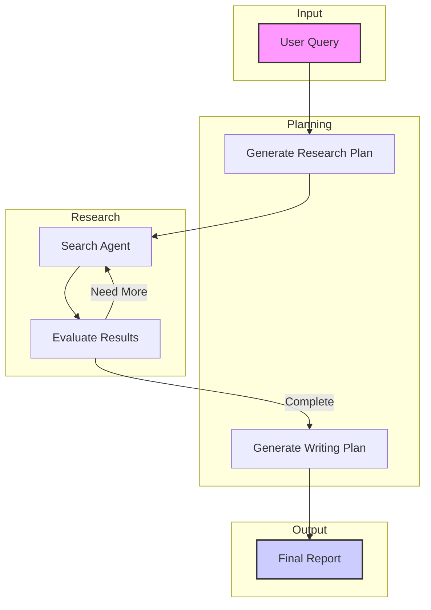

# OpenDeepResearcher via Searxng 🧑‍🔬

A robust research tool that uses AI to perform comprehensive research on any topic, offering flexible deployment through Docker, direct Python execution, or Jupyter notebooks.

## 🚀 Docker/Python Setup (Recommended)

The setup provides an OpenAI-compatible API endpoint with flexible configuration for different operation modes:

1. Configure `research.config` based on your needs:
   ```ini
   [Settings]
   # Choose your operation mode:
   use_jina = true/false    # Use Jina API for fast web parsing
   use_ollama = true/false  # Use local Ollama models
   with_planning = true     # Enable research planning
   
   # For online mode (Maximum Speed):
   use_jina = true
   use_ollama = false
   default_model = anthropic/claude-3.5-haiku
   reason_model = deepseek/deepseek-r1-distill-qwen-32b
   
   # For hybrid mode (Balance):
   use_jina = true
   use_ollama = true
   
   # For fully local mode (Maximum Privacy):
   use_jina = false
   use_ollama = true
   default_model = mistral-small
   reason_model = deepseek-r1:14b
   
   [API]
   openai_url = https://openrouter.ai/api/v1/chat/completions # Most OpenAI compatible endpoint
   openai_compat_api_key = your-key-here  # For API authentication
   jina_api_key = your-jina-key          # Only needed if use_jina = true
   ```

2. Setup Requirements:
   - For local models (if use_ollama = true):
     ```bash
     ollama pull mistral-small    # search & writing
     ollama pull deepseek-r1:14b  # reasoning & planning
     ```
   - For local web parsing (if use_jina = false):
     ```bash
     # Start Chrome debug mode, add optional user-data-dir for profile with online credentials
     google-chrome --remote-debugging-port=9222 [--user-data-dir=/path/to/profile]
     
     # Optional: Enhanced parsing
     ollama pull reader-lm:0.5b  # webpage parsing
     pip install docling         # PDF parsing
     ```

3. Choose your deployment:
   
   A. Using Docker and CPU (recommended):
   ```bash
   cd docker
   docker compose up --build
   ```

   A.1. Using Docker and GPU 
   ```bash
   docker compose -f docker-compose.xxx.yml up --build # xxx = cuda or rocm
   ```
   **But for most user, I still suggest using CPU version for smaller file size as GPU now is only used for accelerating PDF OCR in fully local mode**

   B. Direct Python (same functionality without containerization):
   ```bash
   cd docker
   pip install -r requirements.txt
   python main.py  # Runs on http://localhost:8000
   ```

4. Access points:
   - API: http://localhost:8000/v1 (OpenAI-compatible endpoint)
   - SearXNG: http://localhost:4000
   - Chrome Debug: http://localhost:9222 (only needed if use_jina = false)

5. Usage Example:
   ```python
   import openai
   openai.base_url = "http://localhost:8000/v1"
   openai.api_key = "your-key-here"  # From research.config
   
   response = openai.chat.completions.create(
       model="deep_researcher",
       messages=[{"role": "user", "content": "What is quantum computing?"}],
       # Research control parameters
       max_iterations=10,  # Control research depth (1-50)
       max_search_items=4,  # Results per search (1-20), only for use_jina = false
       stream=True,  # Enable streaming for live updates
       # Optional: Override models from config
       default_model="anthropic/claude-3.5-haiku",
       reason_model="deepseek/deepseek-r1-distill-qwen-32b"
   )
   
   # Stream output
   for chunk in response:
       print(chunk.choices[0].delta.content or "", end="")
   ```

## 📓 Jupyter Notebook Setup (Alternative)

If you prefer using Jupyter notebooks directly:

### 1. Online Mode (Maximum Speed)
- Uses OpenRouter API and Jina API for fastest performance
- Notebooks:
  - Basic: [open_deep_researcher.ipynb](open_deep_researcher.ipynb)
  - With Planning: [open_deep_researcher_with_planning.ipynb](open_deep_researcher_with_planning.ipynb)
- Requirements: OpenRouter API key and Jina API key

### 2. Hybrid Mode (Speed/Privacy Balance)
- Uses Ollama local models with Jina API
- Notebooks:
  - Basic: [local_open_deep_researcher.ipynb](local_open_deep_researcher.ipynb)
  - With Planning: [local_open_deep_researcher_with_planning.ipynb](local_open_deep_researcher_with_planning.ipynb)
- Requirements: Ollama installation

### 3. Fully Local Mode (Maximum Privacy)
- Uses Ollama models and Playwright for complete local operation
- Notebooks:
  - Basic: [local_open_deep_researcher_via_playwright.ipynb](local_open_deep_researcher_via_playwright.ipynb)
  - With Planning: [local_open_deep_researcher_with_planning_via_playwright.ipynb](local_open_deep_researcher_with_planning.ipynb)
- Requirements: 
  - Chrome/Chromium with debug mode
  - Optional: reader-lm and docling for enhanced parsing

## 🧑‍🔬 How It Works



## ⚙️ Core Components

- **SearXNG**: Private, unbiased search (local or [public instance](https://searx.space))
- **Content Parsing**:
  - Fast: Jina API
  - Private: reader-lm + docling (local)
- **LLM Provider**:
  - Fast: OpenRouter API
  - Private: Ollama (local models)

## 🏁 Roadmap

- [x] Support Ollama
- [x] Support Playwright and your own credentials to bypass publisher limits
- [x] Use Playwright and Ollama's reader-lm for 100% local service
- [x] Make into a docker image for easy install
- [ ] Refine process and reduce token usage via DSPy
- [ ] Integrate tool calling

## 💡 Troubleshooting

- **RuntimeError with asyncio**: Install and apply `nest_asyncio`
- **API Issues**: Verify API keys and rate limits
- **Jina URL resolve issue**: Wait and retry, usually due to high load
- **Chrome Connection**: Only needed when not using Jina API
- **SearXNG Access**: Verify port 4000 is available

---

Follow original author Matt on [X](https://x.com/mattshumer_) for base code updates.

Follow this repo for academic and local use updates.

OpenDeepResearcher and OpenDeepResearcher-via-searxng are released under the MIT License. See the LICENSE file for more details.
