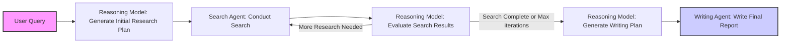

# OpenDeepResearcher🧑‍🔬 via Searxng 

## Noe with citations🧑‍🏫 and planning agent🤖 from reasoning models!!

This notebook implements an **AI researcher** that continuously searches for information based on a user query until the system is confident that it has gathered all the necessary details. It makes use of several services to do so:

- **SEARXNG**: To perform searches without bias and privately.
- **Jina**: To fetch and extract webpage content.
- **OpenRouter**: To interact with a LLM for generating search queries, evaluating page relevance, and extracting context.
   - default searching and writing model: `anthropic/claude-3.5-haiku`
   - default reasoning and planning model: `deepseek/deepseek-r1-distill-qwen-32b`

## TL;DR

Run [open_deep_researcher.ipynb](open_deep_researcher.ipynb) to save money, run [open_deep_researcher_with_planning.ipynb](open_deep_researcher_with_planning.ipynb) to get better quality with reasoning.

## Features

- **Iterative Research Loop:** The system refines its search queries iteratively until no further queries are required.
- **Asynchronous Processing:** Searches, webpage fetching, evaluation, and context extraction are performed concurrently to improve speed.
- **Duplicate Filtering:** Aggregates and deduplicates links within each round, ensuring that the same link isn’t processed twice.
- **LLM-Powered Decision Making:** Uses the LLM to generate new search queries, decide on page usefulness, extract relevant context, and produce a final comprehensive report, now with citations.
- **Plans made with Reasoning:** Before each iteration, a reasoning model will plan what to search, what to search more and how to write the final report to ensure robust planning strategy and good final quality. (only with [open_deep_researcher_with_planning.ipynb](open_deep_researcher_with_planning.ipynb))

## Planning via Reasoning



## Requirements

- API access and keys for:
  - **OpenRouter API**
  - **Jina API**
- Local or public instance of **Searxng**
   - Get started locally
      - `docker run -d --name searxng --restart always -v $(pwd)/searxng:/etc/searxng:rw -p 4000:8080 docker.io/searxng/searxng:latest`
      - More at [https://docs.searxng.org/admin/installation-docker.html#installation-docker](https://docs.searxng.org/admin/installation-docker.html#installation-docker)
   - Public instance
     - [searx-instances](https://github.com/searx/searx-instances)
     - May have rate limits or usage logging

## Setup

1. **Clone or Open the Notebook:**
   - Download the notebook file.

2. **Install `nest_asyncio`:**

   Run the first cell to set up `nest_asyncio`.

3. **Configure API Keys:**
   - Replace the placeholder values in the notebook for `OPENROUTER_API_KEY`, and `JINA_API_KEY` with your actual API keys.

4. **Set Base Searxng URL**
   - Replace the placeholder values in the notebook for `BASE_SEARXNG_URL` with the instance you like.

## Usage

1. **Run the Notebook Cells:**
   Execute all cells in order. The notebook will prompt you for:
   - A research query/topic.
   - An optional maximum number of iterations (default is 10).

2. **Follow the Research Process:**
   - **Initial Query & Search Generation:** The notebook uses the LLM to generate initial search queries.
   - **Asynchronous Searches & Extraction:** It performs SERPAPI searches for all queries concurrently, aggregates unique links, and processes each link in parallel to determine page usefulness and extract relevant context.
   - **Iterative Refinement:** After each round, the aggregated context is analyzed by the LLM to determine if further search queries are needed.
   - **Final Report:** Once the LLM indicates that no further research is needed (or the iteration limit is reached), a final report is generated based on all gathered context.

3. **View the Final Report:**
   The final comprehensive report will be printed in the output.

## How It Works

1. **Input & Query Generation:**  
   The user enters a research topic, and the LLM generates up to four distinct search queries.

2. **Concurrent Search & Processing:**  
   - **SEARXNG:** Each search query is sent to searxng concurrently.
   - **Deduplication:** All retrieved links are aggregated and deduplicated within the current iteration.
   - **Jina & LLM:** Each unique link is processed concurrently to fetch webpage content via Jina, evaluate its usefulness with the LLM, and extract relevant information if the page is deemed useful.

3. **Iterative Refinement:**  
   The system passes the aggregated context to the LLM to determine if further search queries are needed. New queries are generated if required; otherwise, the loop terminates.

4. **Final Report Generation:**  
   All gathered context is compiled and sent to the LLM to produce a final, comprehensive report addressing the original query. And the llm is instructed to properly cite the sources and summarize all the citations into a bibliography list.

## Troubleshooting

- **RuntimeError with asyncio:**  
  If you encounter an error like:
  ```
  RuntimeError: asyncio.run() cannot be called from a running event loop
  ```
  Ensure you have applied `nest_asyncio` as shown in the setup section.

- **API Issues:**  
  Verify that your API keys are correct and that you are not exceeding any rate limits.

---

Follow original author Matt on [X](https://x.com/mattshumer_) for updates on the base code.

Follow this repo for updates from my side for academic use.

OpenDeepResearcher and OpenDeepResearcher-via-searxng are released under the MIT License. See the LICENSE file for more details.
